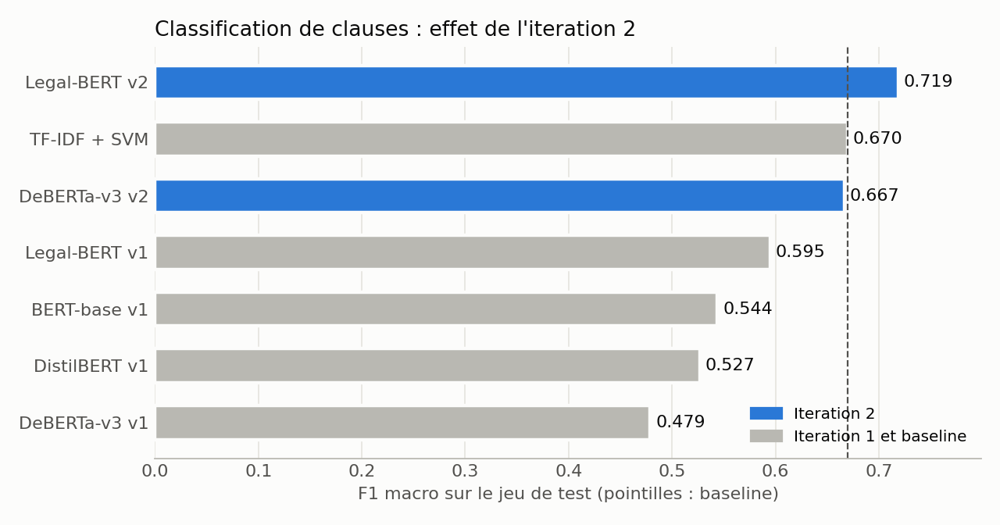

# Agent d'audit de conformité documentaire

Système qui analyse un contrat et produit un rapport d'audit clause par clause :
pour chaque clause, un verdict (conforme, non conforme, à vérifier, manquante),
une justification et la citation de l'article de loi applicable.

**Projet Big Data & Deep Learning — 5ème année Ingénierie Data Science & IA**

---

## Le problème

La vérification de conformité d'un contrat est aujourd'hui faite à la main par un
juriste, clause par clause : environ 3 heures pour un contrat de 40 pages. Le
travail est coûteux, difficile à tracer, et les clauses manquantes sont faciles
à rater. Ce projet automatise cette vérification.

---

## Architecture cible

```
Contrat PDF / DOCX
      |
      v
[1] Extraction du texte (OCR si le document est scanné)
      |
      v
[2] Découpage en clauses
      |
      v
[3] Classification du type de clause          <-- terminé (Legal-BERT, F1 macro 0.719)
      |
      v
[4] Recherche de l'article de loi (RAG)
      |
      v
[5] Jugement de conformité (LLM)
      |
      v
[6] Rapport d'audit
      |
      v
[7] API + interface web + monitoring
      |
      v
   Correction par un juriste --> réentraînement
```

Couche Big Data prévue : ingestion en flux (Kafka), traitement distribué (Spark),
stockage en data lake.

---

## Données

**CUAD** (Contract Understanding Atticus Dataset) : 510 contrats commerciaux
réels, annotés par des juristes sur 41 catégories de clauses.

| Étape | Volume |
| --- | --- |
| Corpus brut (v1, versionné DVC) | 1,7 Go |
| Clauses étiquetées (v2) | 10 134 clauses, 41 catégories |
| Entraînement / test | 8 222 / 1 912 clauses |

Le jeu est déséquilibré : les catégories fréquentes dépassent 500 exemples,
les plus rares en ont moins de 20. C'est ce qui explique le choix du **F1 macro**
comme métrique principale : il donne le même poids à chaque catégorie, rare ou
fréquente.

---

## Résultats : classification des clauses

Sept modèles comparés sur le même jeu de test, tous tracés dans MLflow
(expérience `01-classification-clauses`).

| Modèle | Itération | F1 macro | Accuracy | F1 pondéré |
| --- | --- | --- | --- | --- |
| **Legal-BERT (pondéré)** | 2 | **0,719** | **0,792** | **0,793** |
| TF-IDF + SVM (baseline) | — | 0,670 | 0,750 | 0,740 |
| DeBERTa-v3-small (pondéré) | 2 | 0,667 | 0,746 | 0,741 |
| Legal-BERT | 1 | 0,595 | 0,768 | 0,740 |
| BERT-base | 1 | 0,544 | 0,732 | 0,699 |
| DistilBERT | 1 | 0,527 | 0,724 | 0,693 |
| DeBERTa-v3-small | 1 | 0,479 | 0,693 | 0,657 |



### Ce que montrent ces résultats

**Itération 1 : la baseline résiste.** Entraînés 3 époques avec une perte
standard, les Transformers sont bons sur les catégories fréquentes (Legal-BERT a
la meilleure accuracy, 0,768) mais ratent les catégories rares, ce qui fait
chuter leur F1 macro sous celui de la baseline.

**Le pré-entraînement juridique compte.** Legal-BERT et BERT-base ont la même
architecture et la même taille (110 M de paramètres). Seule différence :
Legal-BERT a été pré-entraîné sur des textes juridiques. Écart : +5 points de
F1 macro.

**Itération 2 : la baseline est battue.** Trois changements ciblent les
catégories rares :

- perte pondérée par l'inverse de la fréquence des classes (racine carrée) ;
- jusqu'à 10 époques avec arrêt automatique après 2 époques sans progrès ;
- sélection de la meilleure époque sur un jeu de validation séparé (10 % du
  train), le jeu de test n'étant utilisé qu'une fois, pour la note finale.

Résultat : Legal-BERT passe de 0,595 à **0,719** de F1 macro (+12 points) et
dépasse la baseline sur toutes les métriques. Sur les catégories rares seules
(moins de 100 exemples), il atteint 0,638.

**Modèle retenu pour le pipeline : Legal-BERT, itération 2.** Il est versionné
avec DVC dans `models/best_model_v2`.

### Reproduire

- Baseline : `python -m src.models.classify_baseline`
- Itération 1 : `notebooks/benchmark_transformers_colab_v2.ipynb` (Google Colab, GPU T4)
- Itération 2 : `notebooks/iteration2_colab.ipynb` (Google Colab, GPU T4)
- Import des résultats Colab dans MLflow : `python -m src.models.log_benchmark reports/benchmark_v2.json`

---

## Stack technique

| Outil | Usage dans le projet |
| --- | --- |
| GitHub | Versionnement du code, historique des contributions |
| DVC | Versionnement des données et des modèles |
| MLflow | Suivi des expériences, comparaison des modèles |
| Hugging Face Transformers | Fine-tuning de BERT, Legal-BERT, DeBERTa |
| Google Colab (GPU T4) | Entraînement des Transformers |
| scikit-learn | Baseline TF-IDF + SVM, métriques |
| FastAPI, Docker | Service d'audit (en cours) |

---

## Démarrage rapide

```powershell
# Environnement (Windows)
python -m venv .venv
.\.venv\Scripts\Activate.ps1
pip install -r requirements.txt

# Données
python -m src.data.download
python -m src.data.prepare

# Baseline
python -m src.models.classify_baseline

# Suivi des expériences
mlflow ui --port 5000          # http://localhost:5000
```

---

## Structure du dépôt

```
.
├── data/            # données, gérées par DVC (non versionnées par Git)
├── models/          # modèles entraînés, gérés par DVC
├── notebooks/       # notebooks d'entraînement Colab
├── reports/         # métriques, tableaux et graphiques des expériences
├── src/
│   ├── data/        # téléchargement et préparation des données
│   ├── models/      # classification des clauses
│   ├── retrieval/   # recherche d'articles (RAG)
│   ├── judge/       # jugement de conformité
│   └── api/         # service FastAPI
├── tests/
├── docs/            # fiche projet, diagrammes, captures
├── dvc.yaml         # pipeline de données reproductible
└── params.yaml      # hyperparamètres
```

---

## État d'avancement

| Phase | Contenu | État |
| --- | --- | --- |
| 1. Fondations | Dépôt, DVC, MLflow, données CUAD | Terminé |
| 2. Classification | 7 modèles comparés, Legal-BERT retenu | Terminé |
| 3. Corpus de lois | RGPD et loi tunisienne, article par article | À faire |
| 4. Recherche d'articles | BM25, recherche dense, hybride | À faire |
| 5. Jugement | LLM qui évalue la conformité et cite l'article | À faire |
| 6. Big Data | Kafka, Spark, data lake | À faire |
| 7. Produit | API, interface web, Docker | À faire |
| 8. MLOps avancé | Orchestration, CI/CD, monitoring | À faire |
| 9. Soutenance | Démo, rapport final | À faire |

---

## Équipe

| Membre | Rôle |
| --- | --- |
| À compléter | À compléter |
| À compléter | À compléter |
| À compléter | À compléter |
| À compléter | À compléter |
